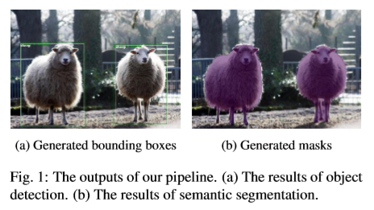
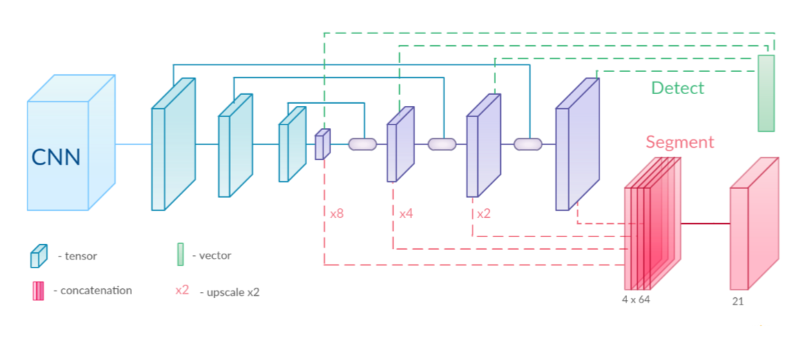
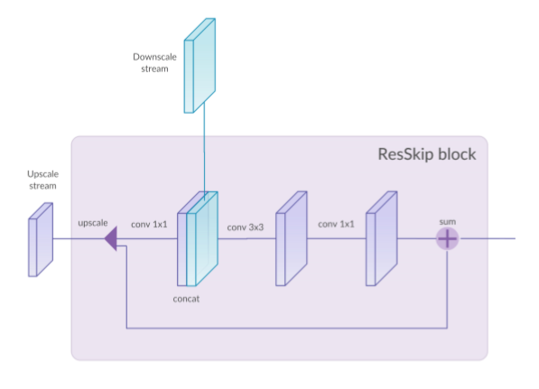
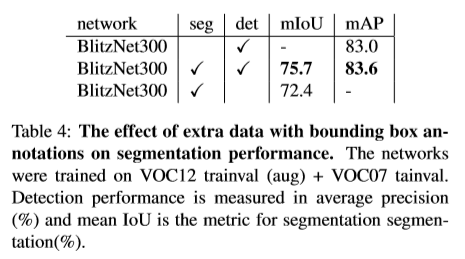
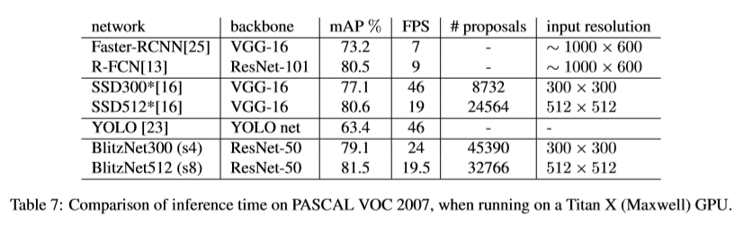

### BlitzNet: A Real-Time Deep Network for Scene Understanding

> BlitzNet：用于场景理解的实时深度网络

### 介绍

在计算机视觉中，对象检测和语义分割是场景理解的两个基本问题。对象检测的目标是检测图片中出现的预定义类别的所有对象和它们的定位边界框，语义分割的目标是解析图像并将类标签与每个像素相关联。

不难发现，良好的分割对目标的检测会有帮助，同时目标的正确识别也对分割很有用。所以，有很强的动机来同时解决这两个任务，使两者互补。

论文的目标是利用在“全局对象级别”，“像素级别”或两者都有标注的图像数据，同时有效地解决目标检测和语义分割这两个问题。

由于论文将目标检测和语义分割结合来解决多任务场景理解问题，为此提出了称为BlitzNet的架构。BlitzNet可以产生实时且精确的分割和目标边界框。

### 模型的全局视图

首先，输入图像经过一个CNN模块来提取具有高级特征的特征图。该模块是一个特征提取器，可以是ResNet-50等模型。

然后，和SSD方法类似，为了在多尺度上高效地搜索边界框，特征图的分辨率依次减少（蓝色部分）。和FCN方法类似，为了预测精确的分割图，通过反卷积层将特征图放大（紫色部分）。这两部分由一系列与ResSkip Blocks交织的反卷积层组成。

最终，在输出的多个尺度的反卷积层上，通过简单的卷积层实现预测：一个用于目标检测（上面），一个用于语义分割（下面）。

### ResSkip Blocks

模型中使用了联合上采样（upscale）输出和下采样（downscale）输出的跳跃连接（skip connections）,具体来说，下采样和上采样使用了上图中被称为ResSkip的简单策略。

首先，使用线性插值方法将输入的特征图上采样到与需要跳跃连接的下采样特征图相同的大小。

然后，上采样的特征图和跳跃连接的下采样特征图被叠加在一起，经由一个（1×1 convolution, 3×3 convolution, 1×1 convolution）的卷积模块得到特征图。

最后，将上一步得到的特征图和和上采样的特征图进行一个残差连接之后得到的特征图作为模块的输出。

### 损失

论文中，将两个任务的损失之和作为了最终损失。

对于分割任务，损失是预测的像素类别和真实的像素类别的交叉熵。对于检测任务，采用了SSD中的损失。

### 实验设置

数据增强：使用了和SSD相同的数据增强方法，包括光度失真、随机剪切、水平翻转、缩放等操作。

优化设置：使用Adam优化算法。批次大小为32。初始学习率为0.0001，在训练过程中学习率以10为因子变小两次。权重衰减参数为0.0005。

模型设置：使用ResNet-50作为特征提取器。在上采样和下采样中特征图个数是512。64个通道用于分割分支的中间表示。BlitzNet300的输入大小是300×300。BlitzNet512的输入大小是512×512。

### 结论

论文介绍了一种将目标检测和语义分割联合训练的方法，通过一个简单的全卷积网络同时解决这两个任务。

之所以可以同时解决目标检测和语义分割这两个问题，是因为这两个任务有相同之处。它们都要求按照目标内部的像素对每一个区域进行分类，都考虑周围的像素，并都从包含位置信息的特征中获取有用信息。
另外，由于网络的权值在两个任务中共享，与单独训练解决一个任务的网络相比，训练同时解决两个任务的网络使两者都从彼此获益。

通过结果可以看出两个任务的性能都获得了提升，且可以进行实时推理。

### 相关连接

[项目地址：http://thoth.inrialpes.fr/research/blitznet/](http://thoth.inrialpes.fr/research/blitznet/)

[论文地址：https://arxiv.org/abs/1708.02813](https://arxiv.org/abs/1708.02813)

[源码地址：https://github.com/dvornikita/blitznet](https://github.com/dvornikita/blitznet)
