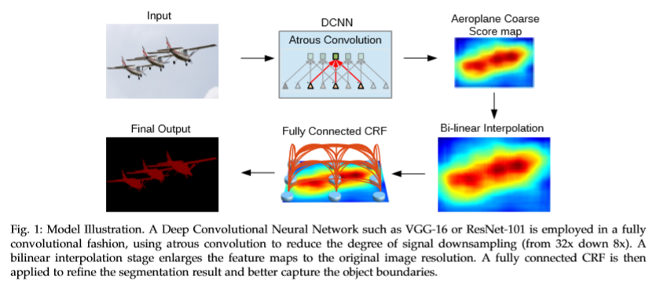
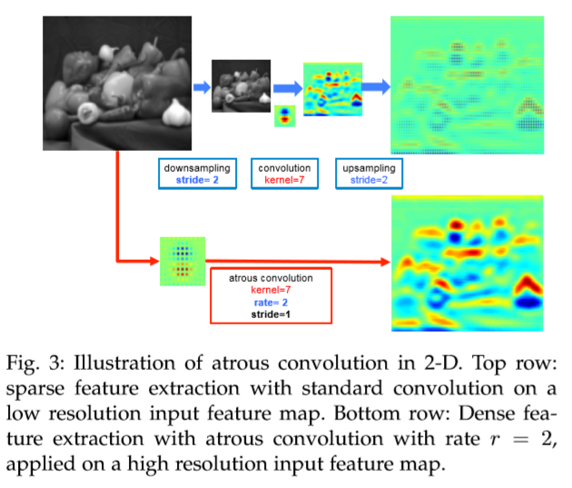
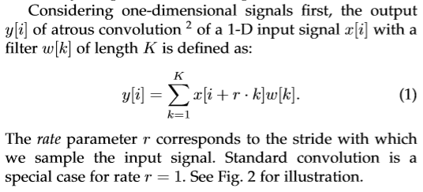
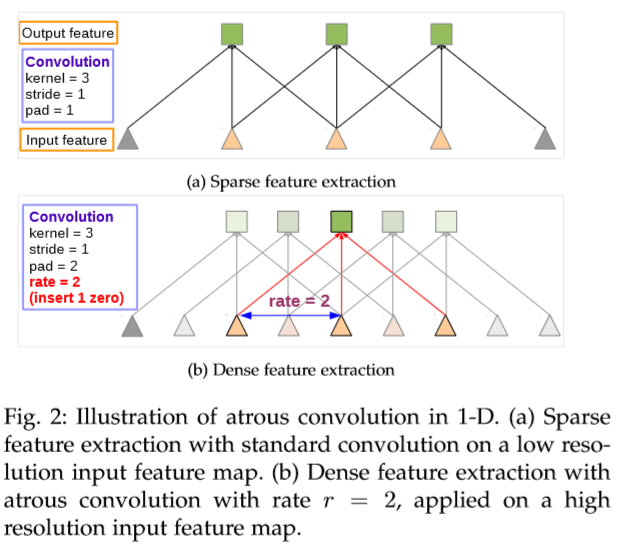
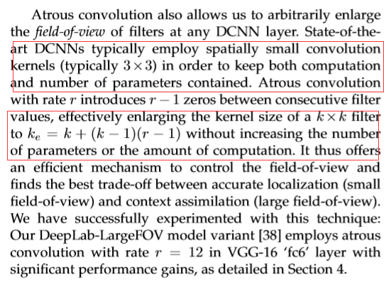
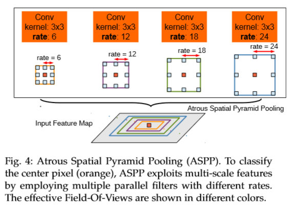
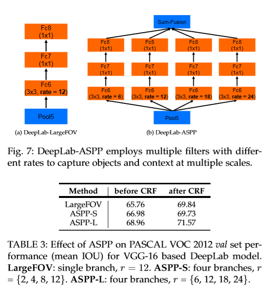

### DeepLab V1&V2
* Semantic Image Segmentation with Deep Convolutional Nets and Fully Connected CRFs
* DeepLab: Semantic Image Segmentation with Deep Convolutional Nets Atrous Convolution and Fully Connected CRFs

# V1
* Semantic Image Segmentation with Deep Convolutional Nets and Fully Connected CRFs

### Abstract
* DCNNs have recently shown state of the art performance in high level vision tasks, 
such as `image classification` and `object detection`.
* We show that responses at `the final layer of DCNNs` are not sufficiently localized
for accurate object segmentation. This is due to the very `invariance properties` that
make DCNNs good for high level tasks.
    * Combine the responses at `the final DCNN layer` with a `fully connected Conditional Random Field`.
* Careful network re-purposing and apply the "hole" algorithm.
    * 重新利用网络/`hole`算法。

### Convolutional neural networks for dense image labeling
Describe how we have `re-purposed` and `finetuned` the publicly available 
Imagenet-pretrained state-of-art 16-layer classification network into an
efficient and effective `dense feature extractor` for 
our `dense semantic image segmentation` system.

* Efficient dense sliding window feature extraction with `the hole algorithm`.

* Controlling `the receptive field size` and `accelerating dense computation` with convolutional nets.
    * We have addressed this practical problem by spatially subsampling (by simple decimation) the first
    FC layer to 4×4 (or 3×3) spatial size. This has reduced the receptive field of the network down to
    128×128 (with zero-padding) or 308×308 (in convolutional mode) and has reduced computation time
    for the first FC layer by 2 − 3 times.

### 基本框架
* 先将所有的全连接层换成卷积层，然后通过atrous conv提高特征图的分辨率
* 用Bilinear线性插值的方法把score map变回原图像尺寸
* 结果送入CRF来细化分割结果

# V2
* DeepLab: Semantic Image Segmentation with Deep Convolutional Nets Atrous Convolution and Fully Connected CRFs

### 贡献
1. `Atrous convolution` with upsampled filters for dense feature extraction
2. `ASPP(atrous spatial pyramid pooling)`, which encodes objects as well as image context at multiple scales
3. Combine DCNN and `fully-connected conditional random fields`, 
in order to produce semantically accurate predictions and 
detailed segmentation maps along object boundaries.

4. 在编码过程中获取上下文信息，因此不需要很大的解码网络。

### Abstract
* First, we highlight convolution with `upsampled filters, or "atrous convolution"`,
as a `powerful tool in dense prediction tasks`. `Atrous convolution` allows us:  
    1. to `explicitly control the resolution` at which 
    feature responses are computed within Deep Convolutional Neural Networks.
        * `Atrous convolution`能够精确地控制分辨率。
    2. to effectively enlarge `the field of view of filters` to incorporate `larger context` 
    without `increasing the number of parameters or the amount of computation`.
        * `Atrous convolution`能够有效地增大感受野、合并上下文信息，但是没有增加参数的数量。

* Second, we propose `atrous spatial pyramid pooling(ASPP)` to robustly segment objects at multiple scales.
    * ASPP probes(探测) an incoming convolutional feature layer with filters at 
    `multiple sampling rates and effective fields of views`, 
    thus `capturing objects as well as image context at multiple scales`.
        * `多尺度获取上下文`：ASPP对卷积层的特征进行按照多个`采样率(sampling rate)`进行探测，因此能够捕捉多个尺度的图片信息。

* Third, we improve the localization of object boundaries by combining methods from DCNNs and
probabilistic graphical models.
    * 通过结合DCNN和概率图模型，来改进对象边界定位。
    * We overcome this by combining the responses at `the final DCNN layer` 
    with a `fully connected Conditional Random Field (CRF)`, which is shown 
    both qualitatively and quantitatively to improve `localization` performance. 

### Related Work
* Most of the successful `semantic segmentation` systems developed in the previous decade 
relied on `hand-crafted features` combined with `flat classifiers`, 
such as `Boosting`,`Random Forests`,or `Support Vector Machines`.
    * 前几十年，比较成功过的`语义分割`系统主要依赖于`手工设计的特征`和`平面分类器`。
    例如，`提升算法`，`随机森林`，`支持向量机`。

* The first family of DCNN-based systems for semantic segmentation employs a 
`cascade of bottom-up image segmentation`, followed by DCNN-based `region classification`.
    * 采用`自底向上的图像分割级联`，然后是基于DCNN的`区域分类`。

* The second family of works relies on using `convolutionally computed DCNN features` 
for dense image labeling and couples them with segmentation that are obtained independently.

* The third family of works uses DCNNs to directly provide `dense category-level pixel labels`,
which makes it possible to even discard segmentation altogether.

* Interestingly, most top-performing methods have adopted one or both of 
the key ingredients of DeepLab system:   
    * `Atrous convolution for efficient dense feature extraction`
    * `Refinement of the raw DCNN scores by means of a fully connected CRF`.

* Weaker supervision has been pursued in a number of papers.

* Integrating into DeepLab more advanced image classification DCNNs 
such as the residual net leads to better results.

### Model Illustration

* A Deep Convolutional Neural Network such as VGG-16 or ResNet-101 is employed in a fully convolutional fashion.
* using atrous convolution to reduce the degree of signal downsampling (from 32x down 8x).
* A bilinear interpolation stage enlarges the feature maps to the original image resolution.
* A fully connected CRF is then applied to refine the segmentation result and better capture the object boundaries.

### Methods
1. `Atrous Convolution` for `Dense Feature Extraction` and `Field-of-View Enlargement`

    
    
    * The use of DCNNs in a `fully convolutional fashion` for semantic segmentation
    employ the `repeated combination of max-pooling and striding` at consecutive layers
    of these networks `reduces significantly the spatial resolution` of the resulting feature maps,
    typically by a factor of 32 across each direction in recent DCNNs. A partial remedy is
    to use `dconvolutional` layers which requires additional memory and time.
        * `全连接网络`通常重复使用`最大池化`，因此`降低了特征图的分辨率`（通常下降32倍）。
        一个补救措施是采用`反卷积`（因此，也就增加了计算时间和内存消耗）
    
    * We advocate instead the use of `atrous convolution`. This allows us to compute the responses of
    any layer at any desirable resolution.
           
        
    
    * In the context of DCNNs one can use atrous convolution in a chain of layers, effectively
    allowing us to compute the final DCNN network resopnses at an arbitrarily high resolution.
        * 在DCNNs中，我们可以链式地应用`atrous convolution`，可以卷积和得到任意分辨率的特征图
    
    * For example, in order to `double the spatial density` of computed feature responses in the 
    ResNet-101 networks, we find the last `pooling or convolutional layer` that `decreases resolution`,
    set its stride to 1 to avoid signal decimation, and replace all subsequent convolutional layers
    with `atrous convolutional layers` having rate r=2. Pushing this approach all the way 
    through the network could allow us to `compute feature responses at 
    the original image resolution`, but this ends up being `too costly`.
    Using` atrous convolution` to increase by a factor of 4 the density of computed feature maps, 
    followed by `fast bilinear interpolation` 
    by an additional factor of 8 to recover feature maps at `the original image resolution`. 
        * 池化层会降低分辨率(decreases resolution)。
        把步长设为1，把卷积替换为`r为2的atrous convolutional`，
        可以得到原始分辨率(the original image resolution)的卷积结果。
        * 但是，`too costly`。
        * 不懂！！！
    
    * 下图讲的非常好
    
        
    * 两种实现方式
        * 一种是常见的：implicitly `upsample the filters` by `inserting holes(eros)`, or
        equivalently `sparsely sample` the input feature maps.
        * 另一种是：通过`一些操作(没有看懂)`得到中间特征图，然后对这些中间特征图应用`标准卷积(standard convolution)`，
        并将结果重新组织成`原始图像分辨率(the original image resolution)`的特征图。
        (reducing `atrous convolution` into `regular convolution`。常规的卷积已经非常成熟且高效)
    
2. Multiscale Image Representations using `Atrous Spatial Pyramid Pooling(ASPP,带孔空间金字塔模型)`
We have experimented with two approaches to handling scale variability in semantic segmentation.

* The first approach amounts to standard multiscale processing(标准的多尺度处理：输入图片多尺度).
     * We extract DCNN score maps from `multiple rescaled` versions of the original 
     image using `parallel DCNN branches` that `share the same parameters`.
        * `共享同样的参数`，用`并行的DCNN分支`从`多尺度原图`中`提取特征图`。
     *  To produce the final result, we `bilinearly interpolate` the feature maps from 
     the `parallel DCNN branches` to the `original image resolution` and fuse them, 
     by taking at each position the `maximum response` across the different scales. 
        * 把并行的DCNN分支提取的特征图插值成原始图像的分辨率，然后把最大响应作为结果。

* The second approach uses multiple parallel atrous convolutional layers 
with different sampling rates(用不同参数的atrous convolutional处理相同的特征图).
    * This is Atrous Spatial Pyramid Pooling
    
     
3. Structured Prediction with Fully-Connected Conditional Random Fields 
for Accurate Boundary Recovery

### Experimental Results
* Finetune the model weights of `the Imagenet-pretrained` VGG-16 or ResNet-101 networks
to adapt them to the semantic segmentation task.
    * 使用Imagenet预训练模型的权重

* Our loss function is `the sum of cross-entropy` terms for 
each spatial position in the CNN output map.
    * 目标函数是交叉熵的和。

* We optimize the objective function by `the standard SGD`.
    * 使用SGD方法进行优化。

### PASCAL VOC 2012
* Results from our conference version
    * We use a mini-batch of 20 images
    * We initial learning rate of 0.001 (0.01 for the final classifier layer),
     multiplying the learning rate by 0.1 every 2000 iterations. 
    * We use momentum of 0.9 and weight decay of 0.0005.

* Improvements after conference version of this work
    1. different learning policy during training.
        * employing a `"poly" learning rate policy`:`(1 - iter/max_iter)**power`(with power=0.9)
        * `"poly" learning rate policy` is more effective than 
        `"step" learning rate`(reduce the learning rate at a fixed step size).
    2. `atrous spatial pyramid pooling`
        *  ASPP for VGG-16 employs several parallel fc6-fc7-fc8 branches. 
        They all use 3×3 kernels but different atrous rates r in the ‘fc6’ 
        in order to capture objects of different size.
            1. Our baseline `LargeFOV` model, having a single branch with r = 12
            2. `ASPP-S`, with four branches and smaller atrous rates (r = {2, 4, 8, 12})
            3. `ASPP-L`, with four branches and larger rates (r = {6, 12, 18, 24})    
        
    3. employment of deeper networks and multi-scale processing.    
        * Similar to what we did for VGG-16 net, we `re-purpose ResNet-101` by `atrous convolution`.
            * 作者建议使用残差网络
        另外，we adopt several other features:
        1. `Multi-scale inputs`
            * We separately feed to the DCNN images at scale={0.5,0.75, 1},
            fusing their score maps by taking the maximum response across scales
            for each position separately.
        2. `Models pretrained` on MS-COCO
        3. `Data augmentation` by randomly scaling the input images (from 0.5 to 1.5) during training.
        
    4. 结果：
        * `Adopting ResNet-101` instead of VGG-16 significantly improves DeepLab performance.
        * `Multiscale fusion` brings extra 2.55% improvement.
        * `Pretraining the model` on MS-COCO gives another 2.01% gain.
        * `Data augmentation` during training is effective (about 1.6% improvement).
        * Further 0.8% improvement is achieved by `atrous spatial pyramid pooling (ASPP)`.

