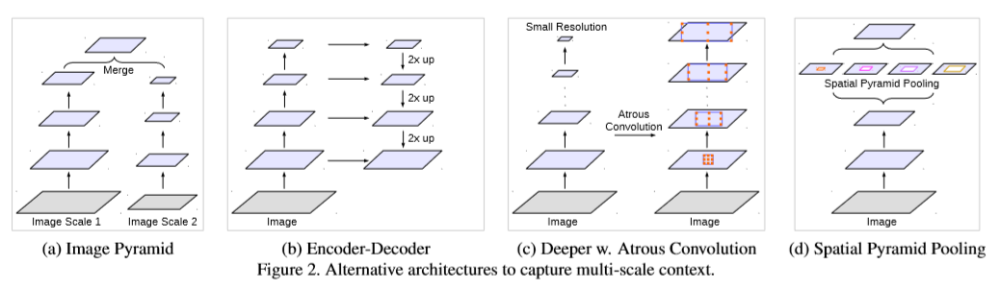
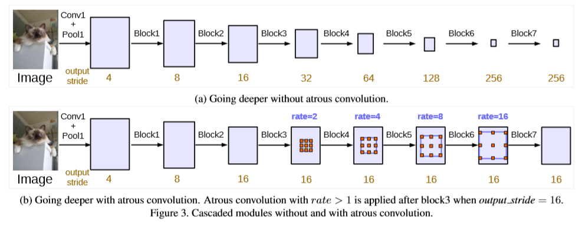
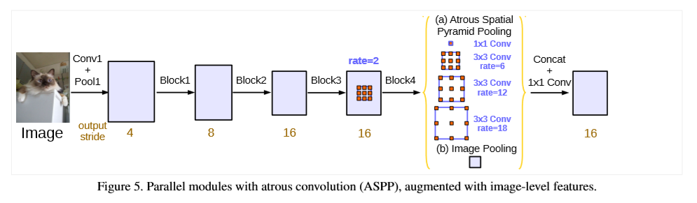

### DeepLab V3: Rethinking Atrous Convolution for Semantic Image Segmentation
[Project: DeepLab-V3](https://github.com/alisure-ml/FCN-DeepLab-V3.git)

### Abstract
* In this work, we revisit `atrous convolution`, a powerful tool to explicitly adjust 
`filter's field-of-view` as well as `the resolution of feature` responses computed by DCNN.
    * atrous convolution 可以确切的调整核的感受野和卷积之后的特征图分辨率。
    
* 为了解决语义对象的多尺度问题，我们用atrous convolutional设计了一个模块来提取多尺度上下文信息

* 对ASPP模块进行增强：探索多尺度的卷积特征，这些特征包含了全局信息。
    * probes convolutional feature at multiple scales, with image-level features encoding
    global context and further boost performance.

* without DenseCRF post-processing.

### Introduction
* 将DCNNs应用到语义分割中有两个挑战：
    1. 池化或者步长大于1的卷积虽然能够学习到抽象的特征表示，但是`会降低特征图的分辨率`。
        * The first one is the `reduced feature resolution` caused by `consecutive pooling
        operations or convolution striding`, which allows DCNNs to learn increasingly
        `abstract feature representations`.
        
        * This invariance to local image transformation may impede dense prediction tasks,
        where detailed spatial information is desired.
            * 局部图像变换的不变性阻碍了密集预测任务，因为密集预测任务需要详细的空间信息。
        
        * 使用atrous convolution可以在一定程度上解决上述问题。
            * Atrous卷积允许我们重新利用ImageNet预训练网络来提取更密集的特征图。
            * 重新利用的方式：把最后几层的下采样层移除，通过在卷积核中插入holes进行上采样。
            * Atrous convolution能够控制特征图的分辨率且不需要额外的参数。
        
    2. 图片中存在`多尺度的对象`（existence of objects at multiple scales）
        * First, applied to an `image pyramid` to extract features for each scale input
        where `objects at different scales become prominent at different feature maps`.
            * 将输入的多个尺度的图像组成`图像金字塔`来提取特征。
            不同尺度的对象在不同的特征图中变得突出。
        * Second, the encoder-decoder structure exploits multi-scale features from 
        the encoder part and recovers the spatial resolution from the decoder part.
            * 编码部分探测多尺度特征，解码部分恢复空间分辨率。
        * Third, `extra modules` are `cascaded` on top of the original network for 
        `capturing long range information`.
            * 在原始的网络上`级联``额外的模块`来捕获大范围的信息。
        * Fourth, `spatial pyramid pooling` probes an feature map with filters 
        or pooling operations at `multiple rates` and `multiple effective field-of-views`.
            * 空间金字塔池化通过不同的rate产生一组特征图，从而捕获多个尺度的对象。
        
        

* In particular, our proposed `module consists of atrous convolution with various rates and 
batch normalization layers` which we found important to be trained as well.
    * 建议使用由`BN`和`atrous convolution`组成的模块。

### Related Work
It has been shown that `global features` or `contextual interactions` are beneficial 
in correctly classifying pixels for semantic segmentation.    
全局特征或者上下文交互有利于语义分割。
* Image pyramid
    * multi-scale inputs(多尺度输入)
* Encoder-decoder
    * encoder: the spatial dimension of feature maps is gradually reduced and thus
    longer range information is more easily captured in the deeper encoder output.
    * decoder: object details and spatial dimension are gradually recovered.
    * `SegNet` / `U-Net` / `RefineNet`
* Context module
    * contains `extra modules` laid out in cascade to `encode long-range context`.
    * joint train both the `CRF` and DCNN components
    * employ several `extra convolutional layers` on top of the belief maps of DCNNs
    to capture context information.(`belief maps` are the final DCNN feature maps 
    that contain output channels equal to the number of predicted classes)
* Spatial pyramid pooling
    * employs `spatial pyramid pooling` to `capture context` at several ranges. 
    * `ParseNet` / `DeepLabv2` / `PSP`(Pyramid Scene Parsing Net)

### Methods
In this section, we review how atrous convolution is applied to extract dense features
for semantic segmentation.   
We then discuss the proposed modules with `atrous convolution modules` employed `in cascade` or `in parallel`.   
如何应用atrous卷积？`级联`或者`并行`地应用`atrous卷积模块`。

* Going Deeper with Atrous Convolution
    
    
* Atrous Spatial Pyramid Pooling
    

### Experimental Evaluation
* Something:   
    * adapt the `ImageNet-pretrained ResNet`.
    * evaluate the proposed models on the `PASCAL VOC 2012` semantic segmentation benchmark.
    * the performance is measured in terms of pixel `intersection-over-union(IOU)` averaged across the 21 classes.
    * `pre-trained model` on `MS-COCO` / `ImageNet` / `JFT-300M` / `VOC 2012` and `fine-tuning model` on VOC 2012.

* Training Protocol
    * `Learning rate policy`: employ a "poly" learning rate policy((1 - iter/max_iter)**power with power=0.9)
    * `Crop size`: (larger crop size)employ crop size to be `513` during both training and test.
    * `Batch normalization`: Our added modules on top of ResNet all include batch normalization parameters.
    * `Upsampling logits`: the target groundtruths are downsampled by 8 during training when output_stride=8.
    * `Data augmentation`: randomly scaling the input images(from 0.5 to 2.0) and 
    randomly left-right flipping during training.
    
* Going Deeper with Atrous Convolution
    * ResNet-50
    * ResNet-101
    * Multi-grid
    * Inference strategy on val set
        * MG:Multi-grid
        * OS:output_stride=8
        * `MS`:Multi-scale inputs during test
        * `Flip`:Adding left-right flipped inputs
        * `COCO`:Model pretrained on MS-COCO

* Atrous Spatial Pyramid Pooling
    * Comparison with DeepLabv2
        * The improvement mainly comes from including and fine-tuning `batch normalization `
        parameters in the proposed models and having a beter way to `encode multi-scale context`.
        * 性能的提升得益于`批量归一化`操作和改进的`多尺度上下文编码`方式。
        
    * Pretrained on COCO
        * We adopt smaller `initial learning rate=0.0001` and `fine-tuning on PASCAL VOC 2012 dataset`.
    
    * Our model is trained with output stride = 8 (so that annotation details are kept) 
    and the batch normalization parameters are frozen.
     
    * `Bootstrapping(引导)` on hard images
        * we `duplicate the images` that contain hard classes (namely bicycle, chair, 
    table, pottedplant, and sofa) in the training set. 
    
    * Model pretrained on `JFT-300M`: 86.9%.
    

### Conclusion
* employs `atrous convolution` with upsampled filters to extract dense feature maps 
and to capture long range context.
    
* to `encode multi-scale information`,our proposed `cascaded module` gradually `doubles 
the atrous rates` while our proposed `atrous spatial pyramid pooling` module augmented 
with image-level features probes the features with filters at `multiple sampling rates` 
and `effective field-of-views`.
    * `模块级联`逐渐doubles the atrous rates
    * `ASPP模块`增加了`图像级特征探测`，该模块采用`多种采样率`和`有效感受野`

### Effect of hyper-parameters 
* New training protocol
    * `larger crop size`
    * `upsampling logits` during training
    * `fine-tuning batch normalization`

* Varying batch size
    * employ small batch size is inefficient to train the model,
    while using larger batch size leads to better performance.

* Output stride
    * The value of `output_stride` determines the output `feature map resolution` and 
    in turn affects `the largest batch size` we could use during training.
    

