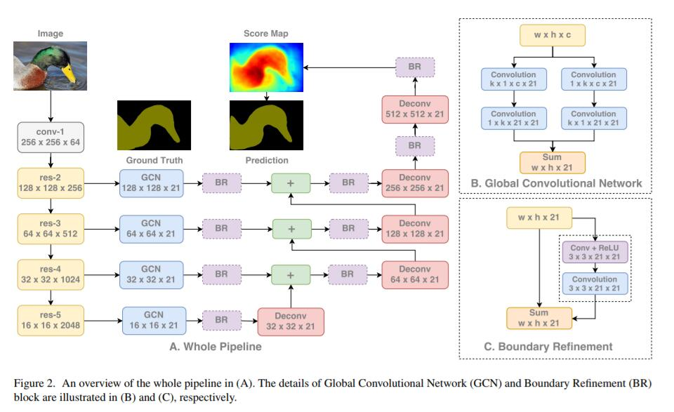

### Large Kernel Matters

### Abstract
1. 在同样计算复杂度下，在整个网络中“堆叠小的卷积核”是设计网络架构的一个趋势，
因为“堆叠小的卷积核”比“大的卷积核”更加高效。   
2. 在“密集的像素级预测”的语义分割中同时进行“分类(classification)”
和“定位(localization)”任务时，“大的卷积核”有非常重要的作用。
3. 根据我们的设计原则，建议用Global Convolutional Network来解决语义分割中的
“分类(classification)”和“定位(localization)”问题，
也建议一个基于残差的边界细化进一步细化物体边界。

### Introduction
1. 语义分割可以看成时每一个像素的分类问题，即像素级分类。在这个问题中有两个任务：
classification和localization。一个设计良好的模型应该能同时解决这两个任务。
2. 分类和定位是两个矛盾的任务:
    * 对于分类任务，模型应该对输入具有转换不变性(invariant to transformation)，因为不希望shifted, rotated or rescaled等变换对结果产生影响。
    * 对于定位任务，模型应该对转换敏感(transformation-sensitive)，因为定位的结果依赖于物体在输入中的位置。
3. 卷积语义分割模型主要关注定位问题，因此就降低了分类性能。
4. 在论文中，我们推荐GCN(Global Convolutional Network, GCN)来同时处理这两个任务。
5. 这里有两个设计原则：
    * 从定位角度来说，在结构上应该用全卷积(fully convolutional)，
    而不用fully-connected or global pooling layers，这些层会丢失位置信息。
    * 从分类角度来说，根据“密集连接结构(densely-connected structure)的动机(对变换应该具有不变性)”，
    应该采用尽可能大的核（当核的大小和特征图大小相同时为全局卷积，和纯分类模型的感受野相同），
    使特征和像素分类器之间进行密集连接，从而增强不同变换的能力。
6. 具体实践
    * 使用FCN风格的结构作为基本的框架
    * 使用GCN生成semantic score maps
    * 采用对称的、分离的大型filter(symmetric, separable large filters)来降低模型的参数和计算复杂度
    * 采用基于“残差结构的边界细化(boundary refinement, BR)”模块对边界进行定位
7. 贡献
    * we propose Global Convolutional Network for semantic segmentation which explicitly 
    address the "classification" and "localization" problems simultaneously.
        * 提出用于语义分割的Global Convolutional Network，可以同时解决分类和定位问题
    * Boundary Refinement block is introduced which can further improve 
    the localization performance near the object boundaries.
        * 提出边界细化模块(Boundary Refinement block)，可以进一步的提升物体边界的定位能力

### Related Work
针对FCN的缺点，基于下面三个方面对FCN进行改进：
1. Context Embedding(上下文嵌入)
    * Zoom-out:提出了手工制作的分级上下文特征
    * ParseNet:增加了全局池化分支提取上下文信息
    * Dilated-Net:在网络后面增加了几层网络来嵌入多尺度上下文
    * Deeplab-V2:使用ASPP(Atrous Spatial Pyramid Pooling,多孔空间金字塔池化)，
    直接将“卷积层结果拼接得到的特征图”作为上下文信息嵌入网络。
    * (注意：这篇论文发布于17年3月，作者还没有接触到RefineNet和PSPNet，所以这里不可能提到)

2. Resolution Enlarging(分辨率扩大)
    * FCN:建议用deconvolution操作增加small score map的分辨率
    * DeconvNet/SegNet:提出unpooling操作
    * LRR:提出上采样feature map比上采样score map效果好
    * Deeplab/Dilated-Net:提出dilated convolution直接增大了small feature map的空间尺寸
    
3. Boundary Alignment(边界对齐)
    * Refine the predictions near the object boundaries(细化对象边界附近的预测).
    * CRF:有完善的数学基础，所以经常被用到
    * denseCRF:Deeplab使用了denseCRF，作为CNN后的后处理方法，是CRF的一个变体。
    * CRFasRNN:把denseCRF转换成了RNN风格的操作，从而加入到了端到端的网络中，但是需要大量的CPU运算。
    * DPN:将denseCRF改进并在GPU上实现了整个计算过程
    * (在17年之前，几乎都是CRF相关的)
    
4. 作者认为语义分割是在大特征图上的分类任务，Global Convolutional Network可以同时满足分类和定位的要求。

### Approach
> 提出了Global Convolutional Network，解决语义分割中的分类和定位问题。
针对语义分割任务，使用GCN设计了一个全卷积框架。

1. 由于分类和定位的不同，产生了不同风格的网络模型
    * 对于分类问题，“特征”是从相对小的隐层中提取的，所以在空间维度上会很粗糙。
    “分类”是整个特征图经由全连接层/全局池化层的密集连接(densely connected)，
    这使得“提取的特征对局部的扰动具有鲁棒性”，允许“分类器处理多种类型的输入变换”。
    * 对于定位问题，需要相对大的特征图编码更多的空间信息。
    Deconvolution/Unpooling/Dilated-Convolution都是用来生成高分辨率特征图的。
    分类器连接特征图上的局部信息生成像素级的分割标签。

2. 使用了对称的、分离的大型filter
    * 降低模型的参数和计算复杂度
    * 在卷积层后面，没有使用任何的非线性
    * 拼接1xk+kx1和kx1+1xk的卷积结果(在inception中有详细的说明)
    
3. 整体框架
    * 使用预训练的ResNet作为特征网络，使用FCN4作为分割框架
    * 从特征网络的不同步提取多尺度的特征图
    * 用“全局卷积网络(GCN)”结构生成每一类的“多尺度的语义score map”
    * 通过deconvolution层将低分辨率的score map上采样后和较高的特征图叠加后生成新的score map
    * 在最后一次上采样后生成最终的语义score map作为输出的预测结果
    * 提出残差风格的Boundary Refinement模块来对边界进行对齐。

### Experiment
1. 实验设计
    * 用在ImageNet上训练的ResNet152作为预训练模型
    * 用SGD优化、批次大小为1、momentum为0.99、weight decay为0.0005
    * 数据增强、减均值、水平翻转
    * 用IoU测量性能
    * 为了让最终特征图为16*16，把图片大小补成512*512

2. How GCN contributes to segmentation results?
    * GCN通过对特征图的densely connections，增进了分割模型的分类能力（增强处理图片变换的能力）。
    * 边界像素主要收到定位能力的影响
    * 将分割score map拆分成两部分，分别评估这两部分的性能
        * boundary region: locate close to objects' boundary(distance<=7)
        * internal region: other pixels

3. Pascal VOC 2012
    * 使用MSCOCO数据库作为预训练的模型
    * 训练分为三个阶段
        1. mix up COCO,SBD,PASCAL VOC 2012的图片(109892张)，padding to 640*640
        2. use SBD,PASCAL VOC 2012的图片，padding to 512*512
        3. use PASCAL VOC 2012的图片，padding to 512*512

4. Cityyscapes
    * 训练分为两个阶段
        1. mix up the coarse annotated images and the training set
        2. only finetune the network on training set

### Conclusion
1. Following the principle of large-size kernels, we propose the
Global Convolutional Network.
2. To further refine the object boundaries, we present a 
novel Boundary Refinement block.
3. Global Convolutional Network mainly improve the internal regions 
while Boundary Refinement increase performance near boundaries.

### Reference
[Large Kernel Matters:Improve Semantic Segmentation by Global Convolutional Network](paper/Large%20Kernel%20Matters.pdf)

