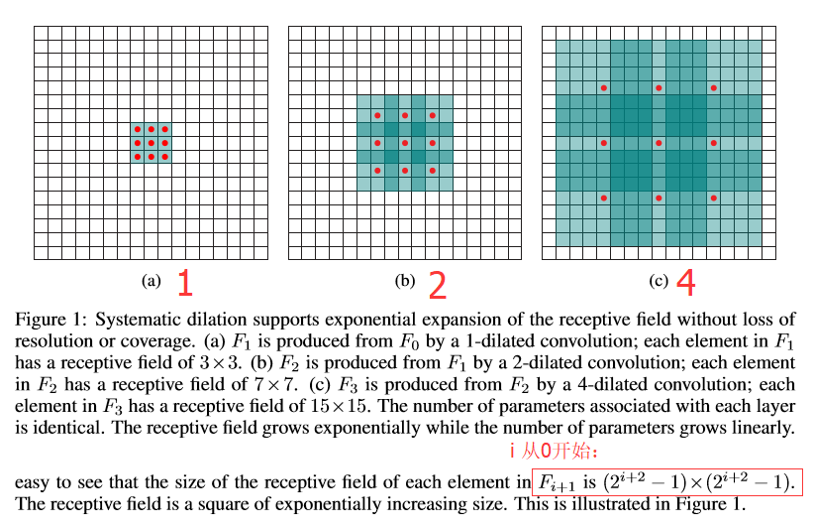
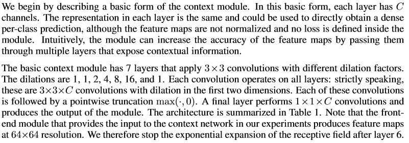

### Multi Scale Context Aggregation by Dilated Convolutions
* [代码实现](https://github.com/alisure-ml/FCN-DilatedConvolution)


### 计算输出shape和感受野大小
* 若进行VALID卷积，需要对输入padding `atrous_rate - 1`个0，否则最外围的输入值就没有被卷积。   
    所以，如果对输入不进行padding，空洞卷积的输出应该减少：  
    ```
    reduce_size = {[k_size * atrous_rate + (atrous_rate - 1)] - 1}
    ```
    由于对输入padding了 `2 * (atrous_rate - 1)`个0，所以最终减少了 `reduce_size - 2 * (atrous_rate - 1)`

* 若进行SAME卷积，输入和输出的形状相同。

* 计算感受野：
    1. 相对于原始输入计算，Define the receptive field of an element p in F_i+1 as the set of elements in F_0
        that modify the value of F_i+1(p).   
        计算公式为：
        ```
        F_i+1(p) = 2 * F_i(p) - 1， F_0 = k_size
        ```
    2. 相对与前一个输入，感受野大小为：`核的大小` - `最外围无效的区域`     
        ```
        [k_size * atrous_rate + (atrous_rate - 1)] - 2 * (atrous_rate - 1)
        ```


### Abstract
* Dense prediction problems such as semantic segmentation
are structurally different from image classification.
* Dilated Convolution module uses dilated convolutions to systematically
aggregate multi-scale contextual information without losing resolution.
    * 使用膨胀卷积收集多尺度上下文信息且没有分辨率损失。
* The architecture is based on the fact that dilated convolutions support
exponential expansion of the receptive field without loss of resolution or coverage.
    * 膨胀卷积支持以指数级扩增感受野且没有分辨率损失或者覆盖。
* The receptive field grows exponentially while the number of parameters grows linearly.
    * 感受野指数级增长，参数数量线性增长。
    

### Introduction
众所周知，图像语义分割需要获取`上下文信息`帮助提高准确率。
* `不使用空洞卷积的传统卷积`通过`下采样（pooling）`来增大感受野，以此获取上下文信息。
    * 卷积核的大小不变
    * 减少了数据量
    * 有利于防止过拟合
    * 但是损失了分辨率，丢失了一些信息
    
* `空洞卷积`通过`膨胀卷积核`来增大感受野，以此获取上下文信息。
    * 参数个数没有增加
    * 数据量没有减少
    * 分辨率没有损失
    * 但是计算量增大，内存消耗增大


### Dilated Convolutions
* 从传统卷积的定义到膨胀卷积的定义：传统卷积是膨胀卷积的特例
* 膨胀卷积的发展历史
* 计算感受野的大小:  
    


### Multi-scale context aggregation (Context module)
* The context module is designed to increase the performance of dense prediction 
architectures by aggregating multi-scale contextual information. 
* The module takes C feature maps as input and produces C feature maps as output. 
The input and output have the same form, thus the module can be plugged into existing 
dense prediction architectures.
    * 模块的输入是C个特征图，输出也是C个特征图。输入和输出的形式相同，因此可以插入到架构中。
* The module can increase the accuracy of the feature maps by passing them 
through multiple layers that expose contextual information.
    * 通过模块提取上下文信息可以提高准确率。   
   


* 膨胀卷积的初始化问题。


### Front end
* Adapted the VGG-16 network for dense prediction and removed the last two pooling and striding layers.
    * 采用VGG-16网络，移除最后的池化层
*  The front-end module takes padded images as input and produces feature maps 
at resolution 64×64. We use reflection padding: the buffer zone is filled by reflecting 
the image about each edge.
    * 前端模块产生64×64的特征图，采用映射padding.
* Convolutions in all subsequent layers were dilated by a factor of 2 for each pooling layer that
was ablated. Thus convolutions in the final layers, which follow both ablated pooling layers,
are dilated by a factor of 4.
    * 通过因子为2的膨胀卷积消除“去掉池化层对分辨率”的影响。最后一层卷积的膨胀因子为4.
* Author found that simplifying the network by removing the pooling layers made it more accurate.
Author also remove the padding of the intermediate feature maps.


# Experiments
* Use all images in MSCOCO with at least one object from the VOC-2012 categories.
Annotated objects from other categories were treated as background.
* Training was performed in two stages:
    * In the first stage, trained on VOC-2012 images and MSCOCO images together.
        * Training was performed by SGD with mini-batch size 14 and momentum 0.9.
            * SGD优化，批次大小为14，动量为0.9
        * 100K iterations were performed with a learning rate of 0.001 and
        40K subsequent iterations were performed with a learning rate of 0.0001.
            * 前10万步的学习率为0.001，后4万步的学习率为0.0001.
    * In the second stage, fine-tuned the network on VOC-2012 images only.
        * Fine-tuning was performed for 50K iterations with a learning rate of 0.00001.
            * 5万步进行微调，学习率为0.00001.

* Three stages:
    * Front-End
    * Context module
    * Joint Front-End and Context module


### Reference
* [Multi Scale Context Aggregation by Dilated Convolutions](paper/Multi-Scale%20Context%20Aggregation%20by%20Dilated%20Convolutions.pdf)

