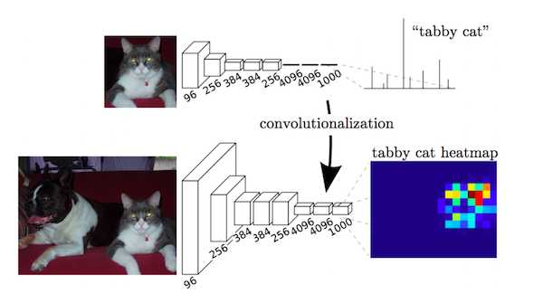
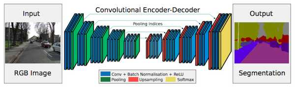
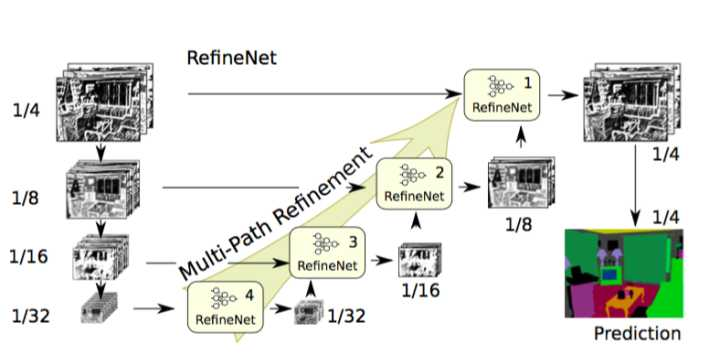
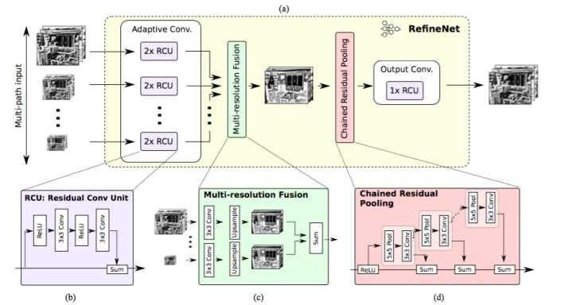
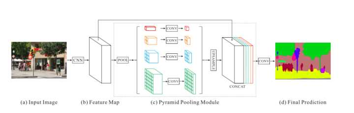

### A 2017 Guide to Semantic Segmentation with Deep Learning
* [语义分割与深度学习全指南2017（译）](https://zhuanlan.zhihu.com/p/27806801)
* [Revolutionizing healthcare with deep learning](http://blog.qure.ai/notes/semantic-segmentation-deep-learning-review)

### 语义分割
> 语义分割指“像素级的图像理解”，对图像中的“每个像素标注所属的类别”。
  Not only recognizing each object,but also have to delineate the boundaries of each object.

* 数据集：VOC and COCO are the most important datasets for semantic segmentation.
    * [VOC2012](http://host.robots.ox.ac.uk/pascal/VOC/voc2012/)
    * [MSCOCO](http://cocodataset.org/)

### 语义分割的方法
* 深度学习之前    
    * Texton Forest
    * Random Forest based classifiers

* 深度学习早期
    * Patch classification
        * 图像块分类：利用像素周围的图像块对每一个像素进行分类。
        > Main reason to use patches was that classification networks usually 
        have full connected layers and therefore required fixed size images.

* FCN时代
    * FCN [Fully Convolutional Networks for Semantic Segmentation](https://arxiv.org/pdf/1411.4038.pdf)
        * Popularized CNN architectures for dense predictions without any fully connected layers.
            * FCN是一个非常流行的没有“全连接层”的“密集的像素级分类”的“CNN架构”。
        * This allowed segmentation maps to be generated for image of any size and 
        was also much faster compared to the patch classification approach.
            * 由于不需要全连接层，可以对“任意大小的图像”进行“语义分割”，且比“图像块分类”方法快很多。
        
    * FCN问题
        * Pooling layer
            * Pooling layers increase the field of view and 
            are able to aggregate the context while discarding the 'where information'.
                * CNN中的池化层能够扩大感受野，可以通过丢弃位置信息来聚合上下文信息。
            * Semantic segmentation requires the exact alignment of class maps and 
            needs the 'where information' to be preserved.
                * 语义分割要求分割结果精确，因此需要保留位置信息。
            
    * FCN架构  
        > 解决FCN问题的两种架构
        1. Encoder-Decoder架构
            * Encoder gradually reduces the spatial dimension with pooling layers and 
            decoder gradually recovers the object details and spatial dimension.
                * 编码器通过“池化层”逐渐“减少空间维度”，解码器逐渐“恢复物体的细节和空间维度”。
            * There are usually shortcut connections from encoder to decoder 
            to help decoder recover the object details better.
                * 为了使解码器有更好的物体细节，通常会有“从编码器到解码器的shortcut连接”。
            
            * 代表模型
                * [U-Net](https://arxiv.org/pdf/1505.04597.pdf)
                * [SegNet/DeconvNet](https://github.com/alisure-ml/SegNet)
                * [RefineNet](https://github.com/alisure-ml/RefineNet)
        
        2. Dilated/Atrous convolutions结构
            * Use dilated or atrous convolutions and do away with pooling layers.
                * 使用空洞/带孔卷积代替池化层。
            * TODO: more info
                * more info
                
            * 代表模型或文章
                * [PSPNet](https://github.com/alisure-ml/PSPNet)
                * [DeepLab](https://github.com/alisure-ml/FCN-Review)
                * [Rethinking Atrous Convolution for Semantic Image Segmentation](https://arxiv.org/pdf/1706.05587.pdf)
                
* FCN后端
    * 条件随机场 Conditional Random Field(CRF)
        * Conditional Random Field(CRF) postprocessing are usually used to improve the segmentation.
            * 通常CRF被用于后处理以改进分割结果（表示怀疑）。
        * CRFs are graphical models which smooth segmentation based on the underlying image intensities.
            * CRFs是一种基于“底层图像的像素强度”进行“平滑分割”的“图模型”。
        * Similar intensity pixels tend to be labeled as the same class.
            * 原理：相似强度的像素趋向于标记为同一类别。
    
    * 后端代表
        * DenseCRF:[全连接CRF](http://liangchiehchen.com/projects/DeepLab.html) [论文](https://arxiv.org/pdf/1412.7062.pdf)
        * CRFasRNN:[Conditional Random Fields as Recurrent Neural Network](https://github.com/alisure-ml/CRFasRNN)

### 语义分割网络代表及架构

1. FCN [Fully Convolutional Networks for Semantic Segmentation](https://arxiv.org/pdf/1411.4038.pdf)
    * 主要贡献
        1. 在语义分割任务中推广了端到端的卷积网络。
        2. 修改ImageNet预训练模型并应用到图像语义分割中。
        3. 采用解卷积实现上采样。
        4. 通过引入跳跃连接改善上采样的粒度。
    
    * 作者将分类网络模型中的“全连接层卷积化”之后，由于CNNs中含有池化操作，
    所以需要通过“上采样”操作将特征图还原成输入大小。由于池化操作造成了信息损失，
    上采样只能生成粗略的分割结果，所以从高分辨率的特征图中引入“跳跃连接”改善上采样的精度。
    
    * 上采样方式
        1. 双线性插值:bilinear interpolation
        2. 解卷积:deconvolutional layers
        3. 上卷积:upconvolution
        4. 完全卷积:full convolution
        5. 转置卷积:transposed convolution
        6. 小数步长卷积（微步卷积）:fractionally-strided convolution
    
    
    
        
2. SegNet [A Deep Convolutional Encoder-Decoder Architecture for Image Segmentation](https://arxiv.org/pdf/1511.00561.pdf)
    * 主要贡献
        1. 将最大池化索引（Maxpooling indices）转换到解码器，提高了分割分辨率
        
    * FCN网路中使用了解卷积层和少量的跳跃连接，但输出的分割图比较粗糙，SegNet引入了更多的跳跃连接。
    SegNet没有使用FCN中编码器产生的特征图，而是使用了最大池化层的索引。
    
    
    
    
3. Dilated Convolutions [Multi-Scale Context Aggregation by Dilated Convolutions](https://arxiv.org/pdf/1511.07122.pdf)
    * 主要贡献
        1. 将VGG网络修改为含空洞卷积的`前端模块（frontend module）`
        2. 提出输入输出、感受野的计算方法
        3. 提出`上下文模块（context module）`，用于空洞卷积的多尺度聚合
        
    * 池化操作能够增加接受野，从而提升分类网络模型的性能。但是池化操作会降低分辨率，并不是语义分割的最佳方法。
    因此，作者提出空洞卷积层。空洞卷积层（DeepLab中称作带孔卷积层）能够不减少空间维度的前提下，
    使感受野呈现指数级增长。
    
    * `前端模块（frontend module）`：
        * 从预训练分类网络（VGG）中移除最后的两个池化层，之后的卷积层均采用空洞卷积。
        模型设置pool-3和pool-4层之间所有卷积层的扩张程度（dilation）为2，
        pool-4之后卷积层的空洞值（dilation）为4。
        * 无需增加参数即可实现密集的像素级类别预测。
    * `上下文模块（context module）`：
        * 使用前端模块的输出作为输入单独训练。该模块由多个不同扩张程度（dilation）的空洞卷积级联而成，
        因此能够聚合不同尺度的上下文信息，从而改善前端模块输出的预测结果。
    
    
    
    
4. DeepLab V1 / V2
    * 主要贡献
        1. TODO
        
    * TODO
    
    
5. RefineNet [RefineNet: Multi-Path Refinement Networks for High-Resolution Semantic Segmentation](https://arxiv.org/pdf/1611.06612.pdf)
    * 主要贡献
        1. 对解码器模块进行精心设计
        2. 所有组件采用残差连接
    
    * 空洞卷积需要大量的高分辨率特征图，对计算量和内存的消耗豆很大，无法应用于高分辨率的精细预测。
    
    * RefineNet的编码器是ResNet-101模块，解码器是RefineNet模块，解码器的输入是高分辨率特征和先前RefineNet输出的低分辨率特征。
    
    
    
    * 每一个RefineNet模块含有一个“通过对低分辨率特征进行上采样操作来融合不同的分辨率特征”的组件和
    基于步长为1、大小为5x5的重复池化层来捕捉上下文信息。
    
    
    

6. PSPNet [Pyramid Scene Parsing Network](https://arxiv.org/pdf/1612.01105.pdf)
    * 主要贡献
        1. 提出金字塔池化模块帮助聚合上下文信息
        2. 采用了辅助损失(auxiliary loss，在主分支损失之外增加了辅助损失）
        
    * PSPNet使用了“空洞卷积”改善ResNet,增加了“金字塔池化模块”
        * 金字塔池化模块通过“较大核的池化层”获取“全局的场景分类”信息，提供语义分割的“类别分布信息”。
        * 金字塔池化模块连接“ResNet的特征图”和“并行池化层的上采样结果”。
        
    
    
7. Large Kernel Matter [Large Kernel Matters -- Improve Semantic Segmentation by Global Convolutional Network](https://arxiv.org/pdf/1703.02719.pdf)
    * 主要贡献
        1. 解释了为什么大型核有好的性能，进而提出了提出Global Convolutional Network，可以同时解决分类和定位问题
        2. 针对边界对齐问题，提出边界细化模块(Boundary Refinement block)，可以进一步的提升物体边界的定位能力
    
    * 语义分割需要同时进行分类和定位，文中采用大型核的卷积来替代全连接层。
        * 由于“密集连接结构”(densely-connected structure)对变换具有不变性，所以
        可以采用尽可能大的核（当核的大小和特征图大小相同时为全局卷积，和纯分类模型的感受野相同），
        使特征和像素分类器之间进行密集连接，从而增强不同变换的能力。
        * 大型核的卷积拥有更多参数，所以需要耗费更多计算量。
        因此，论文将kxk 的卷积近似表示为kx1和kx1、kx1和1xk卷积的加和，
        称该模块为全局卷积网络(Global Convolution Network，GCN)。
    
    * 架构
        1. 编码器是ResNet，没有空洞卷积。
        2. 解码器由GCNs和反卷积构成。
        3. 此外架构还用到了基于残差的边界细化(Boundary Refinement, BR))模块。
    
    
    

8. DeepLab v3 [Rethinking Atrous Convolution for Semantic Image Segmentation](https://arxiv.org/pdf/1706.05587.pdf)
    * TODO
    
    
